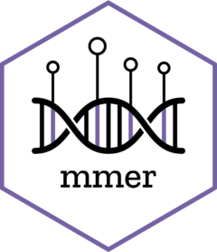
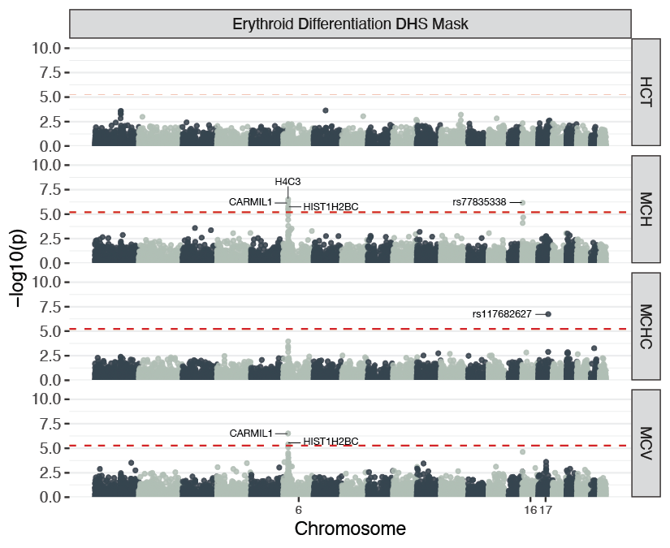

<!-- README.md is generated from README.Rmd. Please edit that file -->
<!-- You'll still need to render `README.Rmd` regularly, to keep `README.md` up-to-date. `devtools::build_readme()` is handy for this. -->

```{r, include = FALSE}
knitr::opts_chunk$set(
  collapse = TRUE,
  comment = "#>",
  fig.path = "man/figures/README-",
  out.width = "100%"
)
```

# mmer - The Multimodal Marginal Epistasis test R implementation 


<!-- badges: start -->
<!-- badges: end -->

The `mmer` package implements a computationally efficient method for detecting marginal epistasis in genome-wide association studies (GWAS).



## Key Features

-	Stochastic Trace Estimation: Enables computational speedup to scale to Biobank scale data.
-	Multimodal Input: Incorporates prior data from HDF5 files to improve power in detecting gene-by-gene interactions.
-	Optimize for Memory Constraints: Parameters like chunk size, number of random vectors, and number of blocks allow to optimize for low memory constraints or fast computation.
-	Parallelization: Utilizes OpenMP for efficient multi-threaded processing.


## Installation

You can install the development version of mmer from [GitHub](https://github.com/) with:

``` r
# install.packages("devtools")
devtools::install_github("jdstamp/mmer")
```

## References

-	Stamp et al. (2023): Leveraging genetic correlation between traits for epistasis detection in GWAS. G3: Genes, Genomes, Genetics.
-	Crawford et al. (2017): Detecting epistasis with the marginal epistasis test. PLoS Genetics.

