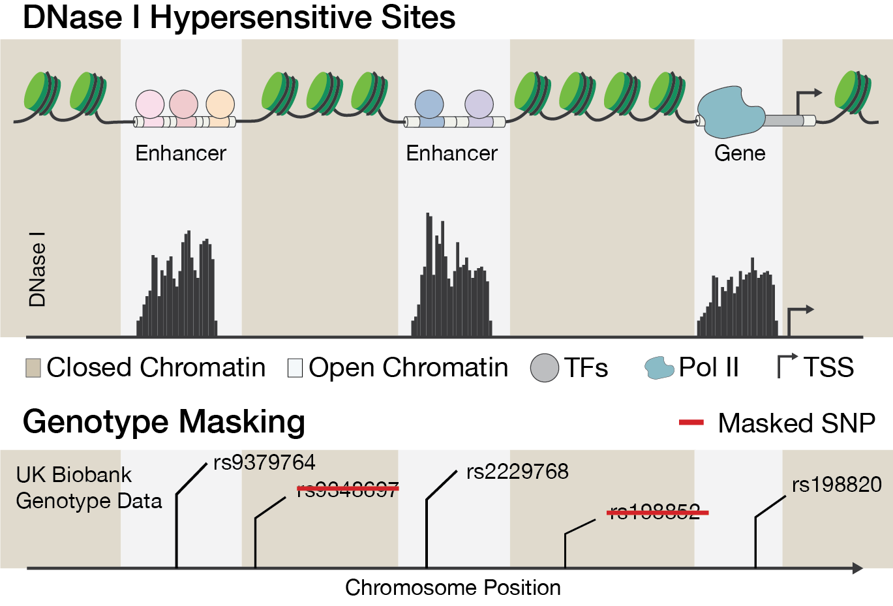

```{r, include = FALSE}
knitr::opts_chunk$set(
  collapse = TRUE,
  comment = "#>"
)
```

```{r setup}
library(mmer)
```

The Multimodal Marginal Epistasis test (MME) accepts a HDF5 file with binary masking data.
The performance of the test depends on how informative the mask is for a trait.
For example, in order to test for marginal epistasis that is attributed to transcriptional activity,
DNase I hypersensitivity sites data can be used to condition the marginal epistasis detection on
accessible chromatin.

---



Cartoon of open chromatin data.  DNase I hypersensitive sites are informative of 
transcriptional activity. The DNase-seq signal is converted to a binary mask. 
Genetic variants in closed inaccessible chromatin regions are excluded from the 
covariance matrix for marginal epistasis. 

---


The mask file format that `mme()` expects is an HDF5 file. In general, the HDF5 format file structure has two major object types:

- Datasets - typed multidimensional arrays
- Groups - container structures that can hold datasets and other groups

## Mask Format Requirements

The mask data for `mme()` needs to be organized in the following groups and datasets.

**Groups**:

- `ld`: Stores SNPs in LD with the focal SNP. These SNPs will be **excluded**.
- `gxg`: Stores indices of SNPs that the marginal epistasis test is conditioned on. These SNPs will be **included**.

The required group names can be configured as input parameters of `mme()`. 
The defaults are `ld` and `gxg`.

**Datasets**:

- `ld/<j>`: For each focal SNP `<j>`, this dataset contains indices of SNPs in the same LD block as 
   that SNP. These SNPs will be **excluded** from the gene-by-gene interaction covariance matrix.
- `gxg/<j>`: For each focal SNP `<j>`, this dataset contains indices of SNPs to **include** in the 
    the gene-by-gene interaction covariance matrix for focal SNP `<j>`.

**Important**: All indices in the mask file data are **zero-based** and should map to the zero-based row indices of the PLINK `.bim` file. This means the index for the dataset (`<j>` in `gxg/<j>`) as well as the data itself.
The reason for this is that the mask data is read from the C++ subroutine of
`mme()` and C++ has zero-based indexing. Note that this is different from the one-based indexing that `mme()` expects for SNP indices in the R function call (R uses one-based indexing).

This package provides basic utility functions to create, write, and read files that
can be used as valid mask files in `mme()`.

```{r}
  hdf5_file <- tempfile()
  
  # group names
  gxg_h5_group <- "gxg"
  ld_h5_group <- "ld"
  
  # the data
  include_gxg_snps <- 1:10 # here still 1-based R indexing
  exclude_ld_snps <- 5:6 # here still 1-based R indexing
  
  # focal SNP
  focal_snp <- 4 # here still 1-based R indexing
  
  # dataset names
  dataset_name_pattern <- "%s/%s"
  gxg_dataset <- sprintf(dataset_name_pattern, gxg_h5_group, focal_snp - 1) # 0-based index!
  ld_dataset <- sprintf(dataset_name_pattern, ld_h5_group, focal_snp - 1) # 0-based index!
  
  # create an empty hdf5 file
  create_hdf5_file(hdf5_file)
  
  # write ld data
  write_hdf5_dataset(hdf5_file, ld_dataset, exclude_ld_snps - 1) # 0-based index!
  
  # write gxg data
  write_hdf5_dataset(hdf5_file, gxg_dataset, include_gxg_snps - 1) # 0-based index!
```

We can check that the data was written correctly.

```{r}
ld_read <- read_hdf5_dataset(hdf5_file, ld_dataset)
gxg_read <- read_hdf5_dataset(hdf5_file, gxg_dataset)

print(sprintf("Zero-based indices of SNPs to exclude: %s", str(ld_read)))
print(sprintf("Zero-based indices of SNPs to include: %s", str(gxg_read)))
```


